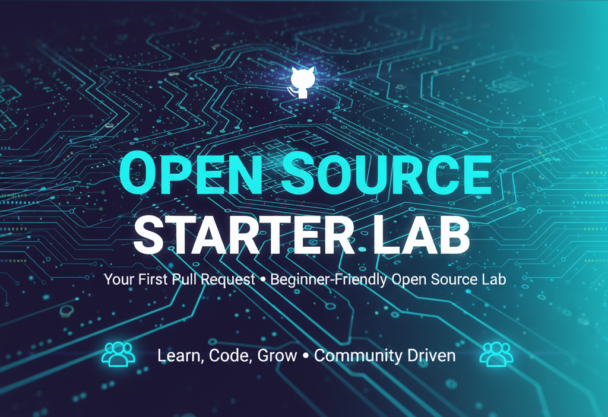
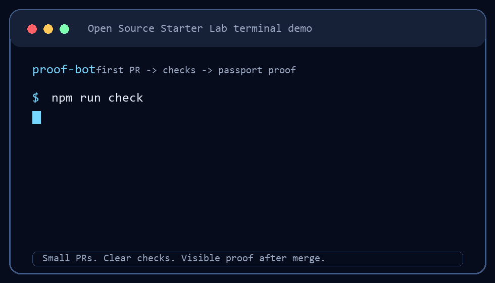
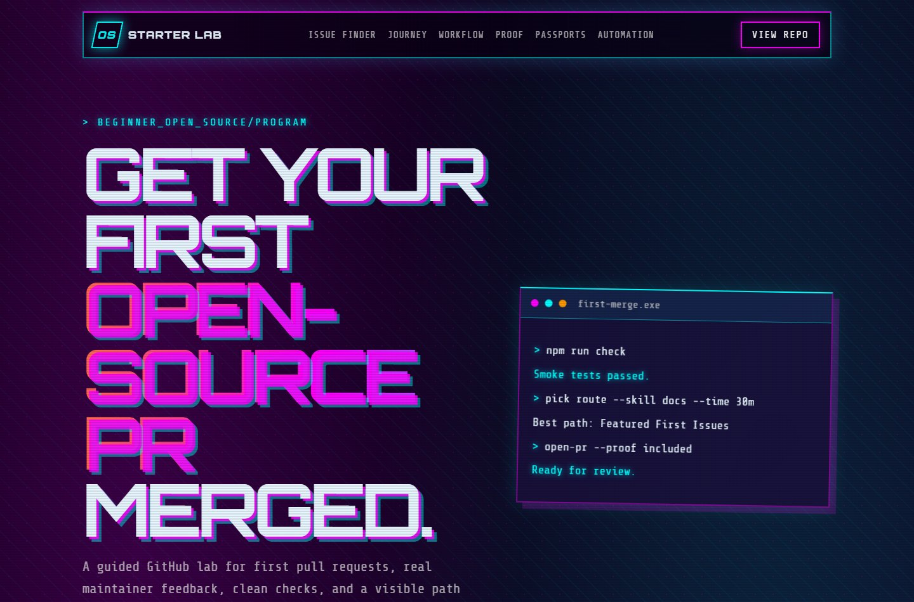
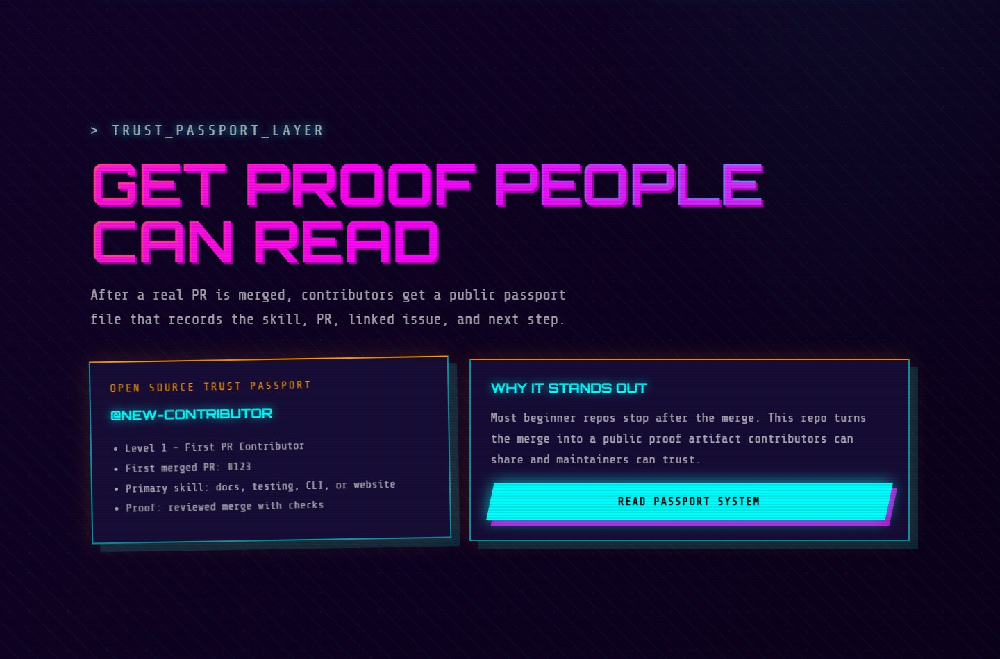
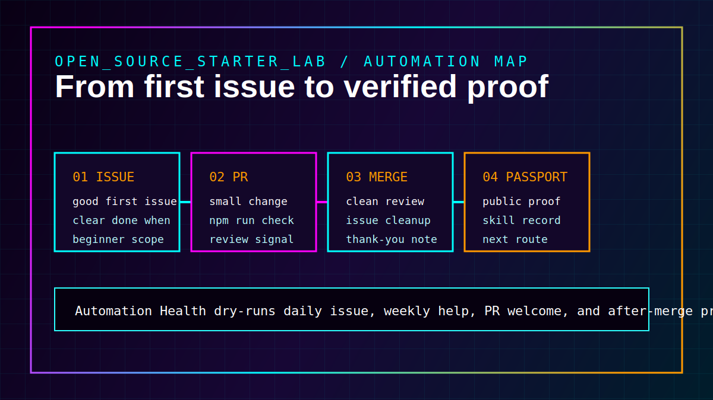
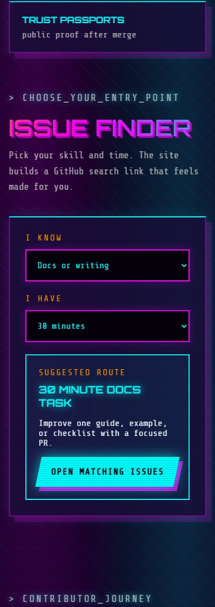
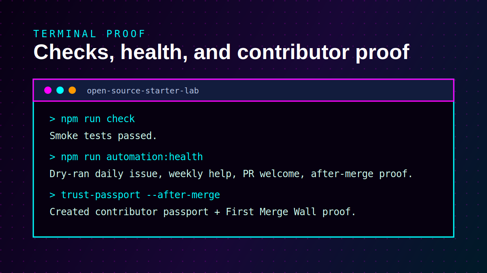

# Open Source Starter Lab

<p align="center">
  
</p>

> A beginner GitHub project for making your first pull request, first open-source contribution, good first issue, and first clean merge.

[](https://github.com/P-r-e-m-i-u-m/open-source-starter-lab/actions/workflows/ci.yml)
[](https://github.com/P-r-e-m-i-u-m/open-source-starter-lab/actions/workflows/pages.yml)
[](https://github.com/P-r-e-m-i-u-m/open-source-starter-lab/actions/workflows/automation-health.yml)
[](https://github.com/P-r-e-m-i-u-m/open-source-starter-lab/actions/workflows/daily-issue-bot.yml)
[](https://github.com/P-r-e-m-i-u-m/open-source-starter-lab/actions/workflows/monthly-maintainer-dashboard.yml)
[](https://github.com/P-r-e-m-i-u-m/open-source-starter-lab/issues?q=is%3Aissue+is%3Aopen+label%3A%22good+first+issue%22)
[](https://github.com/P-r-e-m-i-u-m/open-source-starter-lab/graphs/contributors)
[](LICENSE)

Website: [open-source-starter-lab](https://p-r-e-m-i-u-m.github.io/open-source-starter-lab/)

Most beginner repos say "make your first PR" and stop there. This lab gives contributors small tasks, clear acceptance criteria, copy-paste commands, CI checks, and a safe place to ask questions.

If you searched for **first pull request**, **first open source contribution**, **good first issue**, **beginner GitHub project**, or **how to contribute to open source**, this repo is built for you.

## How It Works In 4 Steps

| Step | What you do | What this repo gives you |
| --- | --- | --- |
| 1 | Pick a small issue | Skill routes, time labels, and curated issue quality scores |
| 2 | Run the check | `npm run check` proves the repo still builds and tests |
| 3 | Open a focused PR | PR welcome guidance tells you what proof to include |
| 4 | Get visible proof | First Merge Wall, Trust Passport, and next issue suggestions |

<p align="center">
  
</p>

## Visual Preview

<p align="center">
  
</p>

| Trust Passport proof | Automation flow |
| --- | --- |
|  |  |

| Mobile issue finder | Terminal proof |
| --- | --- |
|  |  |

Screenshot system notes: [docs/SCREENSHOTS.md](docs/SCREENSHOTS.md)

## Platform Status

| System | Status | Why it matters |
| --- | --- | --- |
| CI | [Workflow](https://github.com/P-r-e-m-i-u-m/open-source-starter-lab/actions/workflows/ci.yml) | Proves the project builds and tests |
| Website | [Live site](https://p-r-e-m-i-u-m.github.io/open-source-starter-lab/) | Shows the contributor journey visually |
| Automation Health | [Workflow](https://github.com/P-r-e-m-i-u-m/open-source-starter-lab/actions/workflows/automation-health.yml) | Dry-runs automation so breakage is caught early |
| Daily Issue Bot | [Workflow](https://github.com/P-r-e-m-i-u-m/open-source-starter-lab/actions/workflows/daily-issue-bot.yml) | Keeps beginner tasks moving |
| Monthly Dashboard | [Workflow](https://github.com/P-r-e-m-i-u-m/open-source-starter-lab/actions/workflows/monthly-maintainer-dashboard.yml) | Refreshes the maintainer view and contributor spotlight |
| Contributor Queue | [Live queue](https://github.com/P-r-e-m-i-u-m/open-source-starter-lab/issues/46) | Shows who needs maintainer attention |
| Trust Passports | [Passport folder](contributors/passports) | Turns merged work into public proof |

## First Merge Command Center

This repo is built to help you move from "I want to contribute" to a real merged pull request without guessing what to do next.

| Goal | Start here | What you get |
| --- | --- | --- |
| Make your first PR | [10 minute path](docs/START_HERE.md) | A short workflow from clone to pull request |
| Find the best open task | [Featured first issues](docs/FEATURED_FIRST_ISSUES.md) | A curated list by time, skill, and confidence |
| Get matched to an issue | [Weekly assignment thread](https://github.com/P-r-e-m-i-u-m/open-source-starter-lab/discussions/44) | A maintainer suggests one task for your skill and time |
| Pick by skill | [Skill routes](docs/SKILL_BASED_FIRST_ISSUES.md) | Docs, Git, JavaScript, Python, testing, or CLI tasks |
| Understand an issue | [First Issue Decoder](docs/ISSUE_DECODER.md) | The first file, first command, scope, and PR proof |
| Prove your work | [First Merge Wall](docs/FIRST_MERGE_WALL.md) | A visible record after your PR is merged |
| Keep going after merge | [Second PR Path](docs/SECOND_PR_PATH.md) | A stronger next task without jumping too far |

## Start In 10 Minutes

1. Pick one route below or check the live issue feed on the website.
2. Comment on an issue: `I would like to work on this. Please assign me.` or simply type `.take` to get automatically assigned by our bot.
3. Run `npm run check`.
4. Open a small pull request with your test output.
5. After merge, add your proof to the [First Merge Wall](docs/FIRST_MERGE_WALL.md).

| I know... | Best first route | Good issue search |
| --- | --- | --- |
| Docs or writing | Improve one guide or example | [Docs first issues](https://github.com/P-r-e-m-i-u-m/open-source-starter-lab/issues?q=is%3Aissue+is%3Aopen+label%3A%22skill%3A+docs%22+no%3Aassignee) |
| JavaScript or TypeScript | Improve one CLI message or command | [JavaScript first issues](https://github.com/P-r-e-m-i-u-m/open-source-starter-lab/issues?q=is%3Aissue+is%3Aopen+label%3A%22skill%3A+javascript%22+no%3Aassignee) |
| Testing | Add one small smoke test | [Testing first issues](https://github.com/P-r-e-m-i-u-m/open-source-starter-lab/issues?q=is%3Aissue+is%3Aopen+label%3A%22skill%3A+testing%22+no%3Aassignee) |
| Git basics | Add or improve a Git workflow guide | [Git beginner issues](https://github.com/P-r-e-m-i-u-m/open-source-starter-lab/issues?q=is%3Aissue+is%3Aopen+label%3A%22skill%3A+git%22+no%3Aassignee) |
| Not sure yet | Tell me your skill and time | [Weekly assignment thread](https://github.com/P-r-e-m-i-u-m/open-source-starter-lab/discussions/44) |

## Live Lab Signals

Before spending time here, check the live proof:

| Signal | Link |
| --- | --- |
| Open starter tasks | [Unassigned good first issues](https://github.com/P-r-e-m-i-u-m/open-source-starter-lab/issues?q=is%3Aissue+is%3Aopen+label%3A%22good+first+issue%22+no%3Aassignee) |
| Live Interactive Feed | [Website Dashboard](https://p-r-e-m-i-u-m.github.io/open-source-starter-lab/#live-issues) |
| Featured starter tasks | [Featured first issues](docs/FEATURED_FIRST_ISSUES.md) |
| Human help queue | [Contributor queue](https://github.com/P-r-e-m-i-u-m/open-source-starter-lab/issues/46) |
| Recent proof | [Merged pull requests](https://github.com/P-r-e-m-i-u-m/open-source-starter-lab/pulls?q=is%3Apr+is%3Amerged+sort%3Aupdated-desc) |
| Maintainer dashboard | [Generated dashboard](docs/MAINTAINER_DASHBOARD.md) |
| Ask for assignment | [Get assigned your first issue this week](https://github.com/P-r-e-m-i-u-m/open-source-starter-lab/discussions/44) |
| Join the passport cohort | [First PR Cohort 01](https://github.com/P-r-e-m-i-u-m/open-source-starter-lab/discussions/61) |
| Contributor proof | [First Merge Wall](docs/FIRST_MERGE_WALL.md) |
| Trust proof | [Contributor Passports](contributors/passports/README.md) |

## Get Your Open Source Trust Passport

This repo now creates an **Open Source Trust Passport** for contributors after a real reviewed PR is merged.

A passport records:

- first merged PR
- skill used
- linked issue
- review proof
- next suggested contribution path
- Level 2 and Level 3 progress for returning contributors and trust builders

Read the system: [docs/CONTRIBUTOR_PASSPORT.md](docs/CONTRIBUTOR_PASSPORT.md)

See passport files: [contributors/passports](contributors/passports)

Join the first cohort: [First PR Cohort 01 - Get your Open Source Trust Passport](https://github.com/P-r-e-m-i-u-m/open-source-starter-lab/discussions/61)

## Pick Your Path

| I want to... | Start here |
| --- | --- |
| Make my first pull request | [First PR guide](docs/FIRST_PULL_REQUEST.md) |
| Avoid common first PR mistakes | [First PR mistakes](docs/FIRST_PR_MISTAKES.md) |
Read common first-time contributor questions [First-time contributor FAQ](docs/FIRST_TIME_CONTRIBUTOR_FAQ.md)
| Understand common open-source words | [Contribution glossary](docs/GLOSSARY.md) |
| Find a small task | [Good first issues](https://github.com/P-r-e-m-i-u-m/open-source-starter-lab/issues?q=is%3Aissue+is%3Aopen+label%3A%22good+first+issue%22) |
| Find a curated first task | [Featured first issues](docs/FEATURED_FIRST_ISSUES.md) |
| Choose the right first issue | [Choosing your first issue](docs/CHOOSING_FIRST_ISSUE.md) |
| Find an issue by skill and time | [First Issue Fit Finder](docs/FIRST_ISSUE_FIT_FINDER.md) |
| Decode an issue before coding | [First Issue Decoder](docs/ISSUE_DECODER.md) |
| Pick by your skill | [Skill-based first issues](docs/SKILL_BASED_FIRST_ISSUES.md) |
| Move after your first merge | [Contributor progress path](docs/CONTRIBUTOR_PROGRESS_PATH.md) |
| Pick your second PR | [Second PR Path](docs/SECOND_PR_PATH.md) |
| Understand PR welcome checks | [PR Welcome Guard](docs/PR_WELCOME_GUARD.md) |
| View the web hub | [Static website](site/index.html) |
| Practice real code changes | [CLI docs](docs/CLI.md) and issues labeled `cli` |
| Ask which issue to take | [Tell me your skill](https://github.com/P-r-e-m-i-u-m/open-source-starter-lab/discussions/35) |
| Get assigned this week | [Weekly assignment thread](https://github.com/P-r-e-m-i-u-m/open-source-starter-lab/discussions/44) |
| See maintainer follow-up | [Contributor queue](docs/CONTRIBUTOR_QUEUE.md) |
| Join weekly help | [Weekly help thread](docs/WEEKLY_HELP_THREAD.md) |
| Add your first merge | [First Merge Wall](docs/FIRST_MERGE_WALL.md) |
| Understand contributor passports | [Contributor Passport](docs/CONTRIBUTOR_PASSPORT.md) |
| Learn maintainer habits | [Maintainer playbook](docs/MAINTAINER_PLAYBOOK.md) |
| Keep automation healthy | [Automation health](docs/AUTOMATION_HEALTH.md) |
| Maintain visual previews | [Screenshot system](docs/SCREENSHOTS.md) |
| Understand issue curation | [Issue quality scoring](docs/ISSUE_QUALITY.md) |
| See the maintainer view | [Maintainer dashboard](docs/MAINTAINER_DASHBOARD.md) |
| See contributor spotlights | [Monthly contributor spotlight](docs/CONTRIBUTOR_SPOTLIGHT.md) |
| Understand the architecture | [Architecture](docs/ARCHITECTURE.md) |
| See the roadmap | [Roadmap](docs/ROADMAP.md) |
| Understand AI-assisted contributions | [AI contribution policy](docs/AI_CONTRIBUTION_POLICY.md) |
| Read project history | [Changelog](CHANGELOG.md) |
| Launch and share the repo | [Launch playbook](docs/LAUNCH_PLAYBOOK.md) |
| Share this with beginners | [Community discovery kit](docs/COMMUNITY_DISCOVERY_KIT.md) |
| Reply in GitHub Community | [GitHub Community reply pack](docs/GITHUB_COMMUNITY_REPLY_PACK.md) |

## Why This Repo Exists

Open source is hard because the first steps are social and technical at the same time. This repo keeps the codebase small, the issues clear, and the review style friendly so contributors can practice the full workflow:

1. Pick an issue.
2. Make a focused change.
3. Run checks.
4. Open a PR with proof.
5. Respond to review.

## What You Can Do Here

- Open your first issue.
- Make your first pull request.
- Make your first open-source contribution.
- Improve docs, examples, and beginner guides.
- Practice Git commands in a real workflow.
- Ask questions in Discussions.
- Help another beginner with a clear answer.
- Learn how maintainers label, review, and verify work.

## Quick Start

```bash
git clone https://github.com/P-r-e-m-i-u-m/open-source-starter-lab.git
cd open-source-starter-lab
npm install
npm run check
```

Try the CLI:

```bash
npm run build
node dist/src/cli.js check --profile beginner
node dist/src/cli.js issues
node dist/src/cli.js fit --skill docs --time 30m
node dist/src/cli.js next --level second-pr
```

## Best First Contributions

Start with one of these:

- Add a short docs page in `docs/`.
- Improve one command example.
- Add a common Git/GitHub error and its fix.
- Add your contributor card in `contributors/`.
- Add or improve one CLI smoke test.
- Improve one daily starter issue idea.
- Answer a beginner question in Discussions.
- Learn how to choose a finishable task: [CHOOSING_FIRST_ISSUE.md](docs/CHOOSING_FIRST_ISSUE.md)
- Learn how to fix a rejected push: [GIT_PUSH_REJECTED.md](docs/GIT_PUSH_REJECTED.md)
- Add yourself after a merge: [FIRST_MERGE_WALL.md](docs/FIRST_MERGE_WALL.md)
- Earn proof after merge: [CONTRIBUTOR_PASSPORT.md](docs/CONTRIBUTOR_PASSPORT.md)

Good first issues are listed here:
[good first issue](https://github.com/P-r-e-m-i-u-m/open-source-starter-lab/issues?q=is%3Aissue+is%3Aopen+label%3A%22good+first+issue%22)

## Find Issues Fast

Use these filtered searches:

- [Good first issues](https://github.com/P-r-e-m-i-u-m/open-source-starter-lab/issues?q=is%3Aissue+is%3Aopen+label%3A%22good+first+issue%22)
- [Beginner friendly issues](https://github.com/P-r-e-m-i-u-m/open-source-starter-lab/issues?q=is%3Aissue+is%3Aopen+label%3A%22beginner+friendly%22)
- [Help wanted issues](https://github.com/P-r-e-m-i-u-m/open-source-starter-lab/issues?q=is%3Aissue+is%3Aopen+label%3A%22help+wanted%22)
- [CLI coding issues](https://github.com/P-r-e-m-i-u-m/open-source-starter-lab/issues?q=is%3Aissue+is%3Aopen+label%3Acli)
- [Unassigned issues](https://github.com/P-r-e-m-i-u-m/open-source-starter-lab/issues?q=is%3Aissue+is%3Aopen+no%3Aassignee)

If you want to work on something, comment on the issue first so nobody duplicates your effort.

## Pick By Skill

Choose the route that matches what you already know:

- [HTML/CSS first issues](https://github.com/P-r-e-m-i-u-m/open-source-starter-lab/issues?q=is%3Aissue+is%3Aopen+label%3A%22skill%3A+html-css%22)
- [JavaScript first issues](https://github.com/P-r-e-m-i-u-m/open-source-starter-lab/issues?q=is%3Aissue+is%3Aopen+label%3A%22skill%3A+javascript%22)
- [Python beginner issues](https://github.com/P-r-e-m-i-u-m/open-source-starter-lab/issues?q=is%3Aissue+is%3Aopen+label%3A%22skill%3A+python%22)
- [Docs first issues](https://github.com/P-r-e-m-i-u-m/open-source-starter-lab/issues?q=is%3Aissue+is%3Aopen+label%3A%22skill%3A+docs%22)
- [Testing first issues](https://github.com/P-r-e-m-i-u-m/open-source-starter-lab/issues?q=is%3Aissue+is%3Aopen+label%3A%22skill%3A+testing%22)
- [Git beginner issues](https://github.com/P-r-e-m-i-u-m/open-source-starter-lab/issues?q=is%3Aissue+is%3Aopen+label%3A%22skill%3A+git%22)

Not sure? Ask here: [Tell me your skill and I'll suggest your first issue](https://github.com/P-r-e-m-i-u-m/open-source-starter-lab/discussions/35).

## No-Shame Git Help

If you are stuck on Git, GitHub, branches, pull requests, or CI, ask in [Discussions](https://github.com/P-r-e-m-i-u-m/open-source-starter-lab/discussions/26) or the [weekly help thread](docs/WEEKLY_HELP_THREAD.md). Beginner questions are welcome here.

Good questions include:

- what command you ran
- what happened
- what you expected
- what operating system you use

## Share This Repo

If someone asks where to make a first pull request or first open-source contribution, use the copy-ready messages in [docs/COMMUNITY_DISCOVERY_KIT.md](docs/COMMUNITY_DISCOVERY_KIT.md).

For a full launch plan with LinkedIn, X, Reddit, DEV, Hashnode, GitHub Community posts, reply templates, and a seven-day distribution plan, use [docs/LAUNCH_PLAYBOOK.md](docs/LAUNCH_PLAYBOOK.md).

## Project Structure

```text
.
|-- src/                  TypeScript CLI source
|-- tests/                Smoke tests
|-- docs/                 Beginner guides and maintainer playbooks
|-- examples/             Copy-paste examples
|-- contributors/         Contributor cards
`-- .github/              CI, templates, and community files
```

## For Contributors

Read [CONTRIBUTING.md](CONTRIBUTING.md), pick one small issue, and comment before starting if you want it assigned. If you are not sure where to begin, use [docs/START_HERE.md](docs/START_HERE.md).

New to open source? [Introduce yourself](https://github.com/P-r-e-m-i-u-m/open-source-starter-lab/discussions/26) with what you know, such as HTML, CSS, JavaScript, Python, TypeScript, docs, or testing. A maintainer can suggest a good first issue.

A good pull request includes:

- What changed
- Why it helps
- How you tested it
- Screenshots or command output when useful

## For Maintainers

This repo is also a maintainer practice lab. Use it to learn:

- How to write useful issues
- How to review without discouraging beginners
- How to answer Discussions clearly
- How to keep project checks simple and visible
- How to turn merged work into contributor proof

See [docs/MAINTAINER_PLAYBOOK.md](docs/MAINTAINER_PLAYBOOK.md).

Automation recovery notes live in [docs/AUTOMATION_HEALTH.md](docs/AUTOMATION_HEALTH.md).

## Launch Kit

Want to invite contributors? Use the copy-ready messages in
[docs/LAUNCH_PLAYBOOK.md](docs/LAUNCH_PLAYBOOK.md). The shorter invite set is still available in
[docs/COMMUNITY_LAUNCH_KIT.md](docs/COMMUNITY_LAUNCH_KIT.md).

## Daily Issue Bot

This repo includes a transparent automation that creates one beginner-friendly starter issue per day from a curated backlog.

Read the bot docs: [docs/DAILY_ISSUE_BOT.md](docs/DAILY_ISSUE_BOT.md).

## Community Standard

Be clear, kind, and useful. Short answers are fine when they solve the problem, but the best answers teach the next person too.

## Contribution Guides

- [Python Learner First PR Guide](docs/PYTHON_LEARNER_FIRST_PR.md)

## License

MIT

